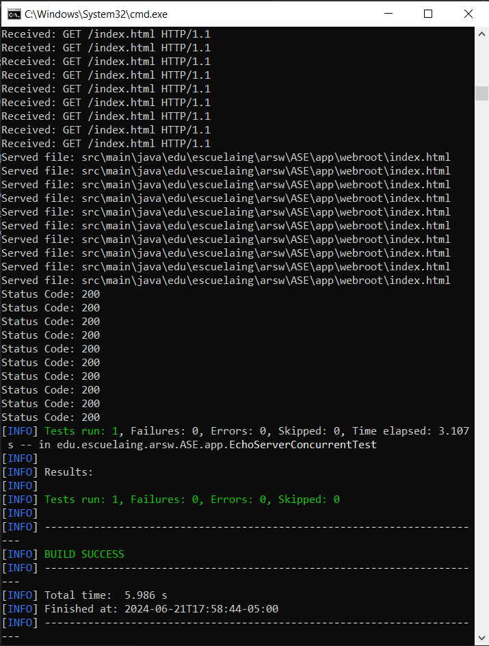
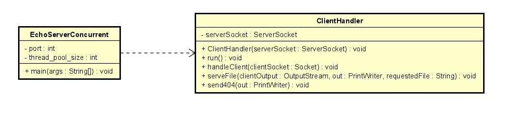
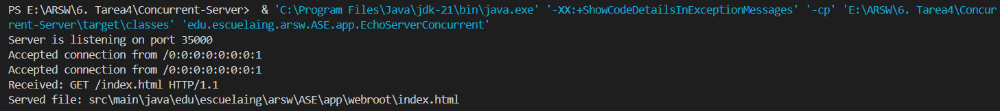
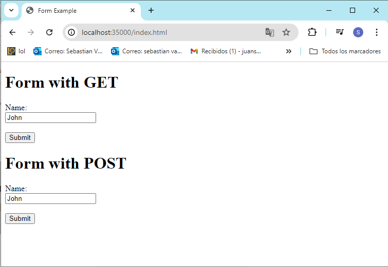

# EchoServer Concurrent

This repository contains a concurrent echo server implemented in Java, designed to handle multiple client connections simultaneously using a fixed thread pool. The server listens on a specified port and responds to HTTP GET requests by serving static files from a predefined web root directory. The server utilizes Java's networking APIs and concurrent programming features to efficiently manage client connections. It includes error handling for client requests and supports basic HTTP response codes such as 200 (OK) and 404 (Not Found). This project is suitable for learning about concurrent server programming and basic web server functionality in Java.


## Getting Started
Download the project from 
[the repository.](https://github.com/Sebasvasquezz/Task1-LOC-Counting)

### Prerequisites

* [Maven](https://maven.apache.org/): Automate and standardize the life flow of software construction

* [Git](https://www.git-scm.com/): Decentralized Configuration Manager

### Installing
1. Maven
    * Download Maven in http://maven.apache.org/download.html
    * You need to have Java installed (7 or 8)
    * Follow the instructions in http://maven.apache.org/download.html#Installation

2. Git
    * Download git in https://git-scm.com/download/win
    * Follow the instructions in https://git-scm.com/book/en/v2/Getting-Started-Installing-Git

## Running the tests

This test suite verifies the functionality and concurrency of an Echo Server implemented in Java using JUnit and Java's HttpClient. The server, EchoServerConcurrent, is tested for its ability to handle multiple concurrent HTTP GET requests correctly.

Once the repository is downloaded, open a command prompt and run the following command to run the unit tests:

```
mvn test
```
The execution:



## Design

### Class Diagram
The class diagram was made by using Astah. To go deeper into it, check out the Concurrent-Server.asta file.

* **EchoServerConcurrent:**

    * **Attributes:**

        * **PORT:** Constant defining the port on which the server listens.
        * **THREAD_POOL_SIZE:** Constant defining the size of the thread pool.

    * **Methods:**

        * **main(String[] args):** Main method that starts the server, creates an ExecutorService with a thread pool, and accepts client connections in an infinite loop.

* **ClientHandler:**

    * **Attributes:**

        * **serverSocket:** A ServerSocket used by the client handler to accept connections.
    * **Methods:**

        * **ClientHandler(ServerSocket):** Constructor that initializes the handler with the ServerSocket.


        * **run():** Overridden method from Runnable that accepts client connections and handles them.

        * **handleClient(Socket):** Method that handles client requests.

        * **serveFile(OutputStream, PrintWriter, String):** Method that serves the file requested by the client.

        * **send404(PrintWriter):** Method that sends a 404 Not Found response to the client.


## Build the project
* Run the comand:
    ```
    mvn package
    ```
* Run the application:
    ```
    mvn exec:java
    ```
    or 
    ```
    & 'C:\Program Files\Java\jdk-21\bin\java.exe' '-XX:+ShowCodeDetailsInExceptionMessages' '-cp' 'E:\ARSW\6. Tarea4\Concurrent-Server\target\classes' 'edu.escuelaing.arsw.ASE.app.EchoServerConcurrent'
    ```
* And the execution:
    * Terminal:

        
    * Browser:

        

    
### Phase architecture
* To allow running the main application directly from the command line using Maven (mvn exec:java):
    ```
    <build>
    <plugins>
        <plugin>
          <groupId>org.codehaus.mojo</groupId>
          <artifactId>exec-maven-plugin</artifactId>
          <version>3.0.0</version>
          <configuration>
              <mainClass>edu.escuelaing.arsw.ASE.app.EchoServerConcurrent</mainClass>
          </configuration> 
    </plugins>
  </build>
    ```
## Built With

* [Maven](https://maven.apache.org/) - Dependency Management

## Authors

* **Juan Sebastian Vasquez Vega**  - [Sebasvasquezz](https://github.com/Sebasvasquezz)

## Date

June 12, 2024

## License

This project is licensed under the GNU License - see the [LICENSE.txt](LICENSE.txt) file for details.